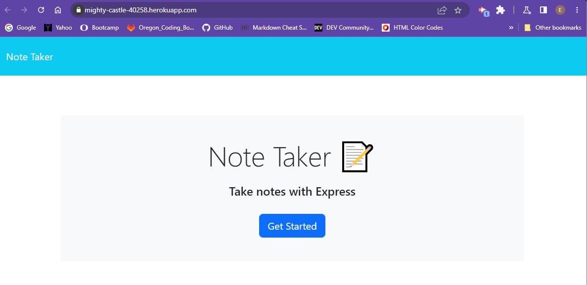

# The Note Taker Express
  [Link to deployed site](https://mighty-castle-40258.herokuapp.com/)

  ## Description

  This application is a simple note taker that was created using Express and deployed using Heroku. The application allows for the user to write, save, and delete notes. Express.js allows for the user to send and recieve data from the db.json file so that the notes are added to the actual site.

  ## Screenshot
  
  ## Sources and Refrences

   [Starter Code](https://github.com/coding-boot-camp/miniature-eureka)
   [Express.js Info](https://expressjs.com/)
   [uuid info](https://www.npmjs.com/package/uuid?activeTab=readme)

  ## Table of Contents

  - [Installation](#installation)
  - [Usage](#usage)
  - [License](#license)
  - [Contributing](#contributing)
  - [Tests](#tests)
  - [Questions](#questions)

  ## Installation

  steps to install:
  n/a

  ## Usage 

  Usage information:
  n/a

  ## License

  None

  ## Contributing 

  Guidelines for contribution:
  n/a

  ## Tests 

  none

  ## Questions

  If you have any questions please contact the project creator at: emaine97@yahoo.com
  And check out more that they have done on their GitHub account at: elissamaine

  Thank You!

